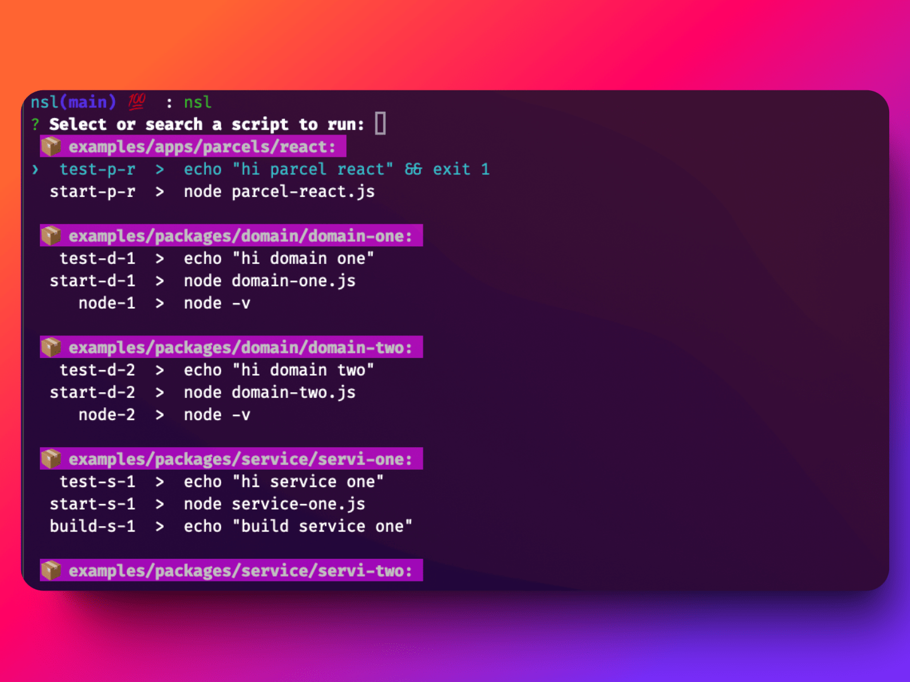

# NSL ⚡️
List, fuzzy search and run scripts from a monorepo

## Usage 🏎️

Just run the command and search for the script you want to run.

```bash
nsl
```


## Install

```bash
npm i -g @rodbe/nsl
```

## License

MIT