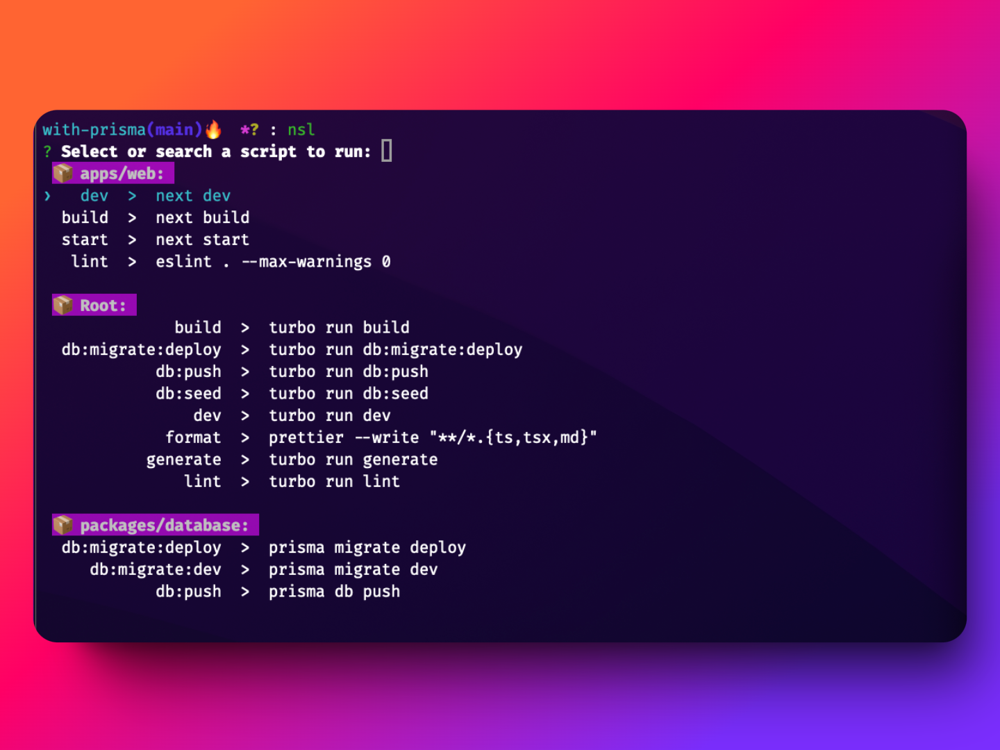

# NSL ⚡️
List, fuzzy search and run scripts from any type of project

> Easy and fast way to run npm scripts  🚀

## Usage 🏎️

Just run the command and search for the script you want to run.

```bash
nsl
```


## Install

```bash
npm i -g @rodbe/nsl
```

> if you have a permission error, try to install with **administrator privileges**
## License

MIT